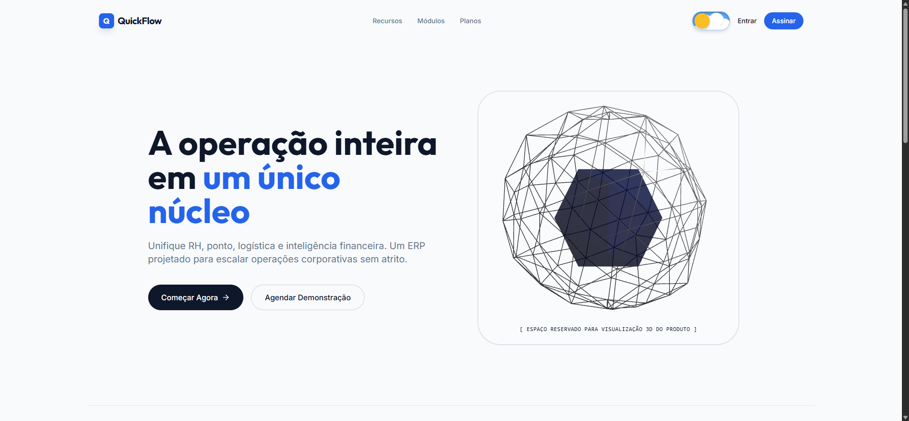
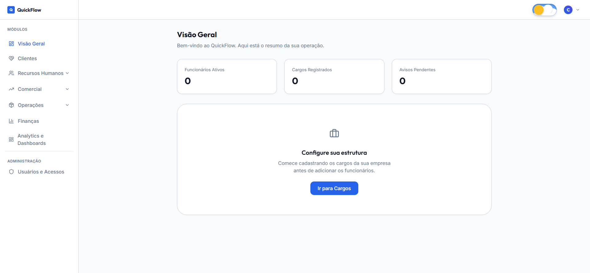
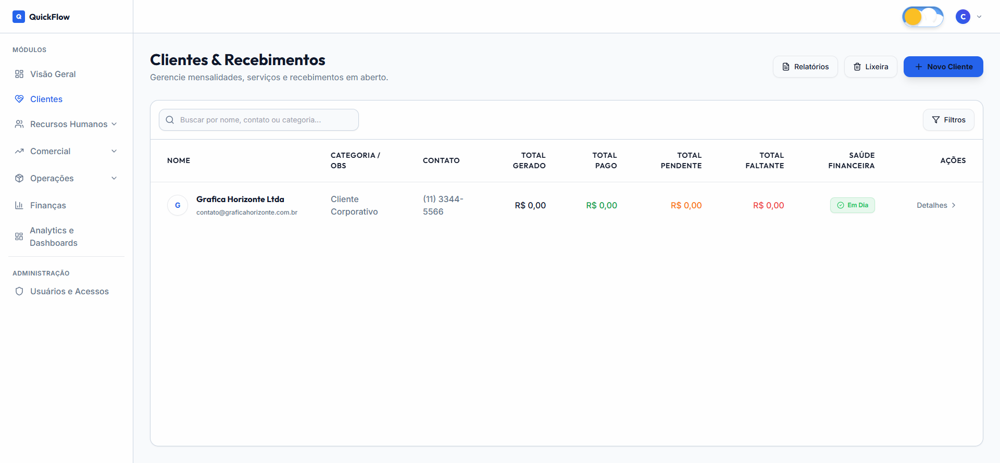
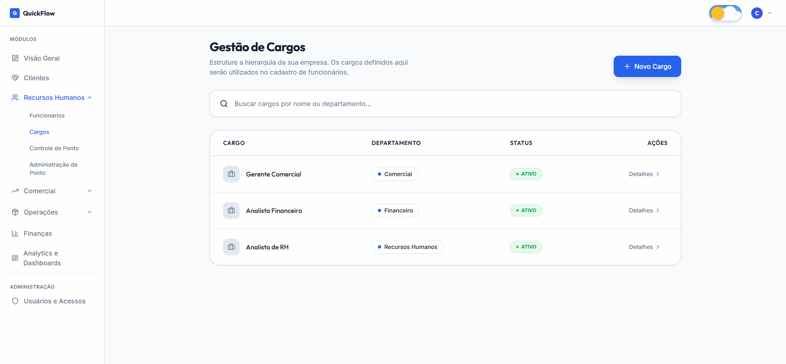

# QuickFlow

QuickFlow é um ERP (Enterprise Resource Planning) web, pensado para pequenas e médias empresas
centralizarem operações que hoje ficam espalhadas em planilhas e ferramentas soltas: cadastro de
clientes e cobranças, folha e gestão de pessoas, controle de ponto, e uma central de dashboards
personalizáveis — tudo num único painel, com controle de acesso por empresa.



## Visão geral

Depois do login, cada empresa tem seu próprio espaço isolado no sistema — nenhuma empresa enxerga
dado de outra. O painel principal reúne todos os módulos numa barra lateral, com atalhos rápidos
para configurar a estrutura da empresa (cargos, funcionários, clientes) assim que a conta é criada.



## Módulos

### Clientes & Financeiro
Cadastro de clientes, lançamentos avulsos e assinaturas recorrentes, com status de pagamento
(pago, pendente, atrasado) calculado automaticamente. Assinaturas ativas geram sua cobrança do mês
sozinhas, sem precisar de nenhum clique manual. Clientes desativados vão para uma lixeira com
purga automática após 30 dias, e um relatório financeiro consolidado mostra o resumo da carteira.



### Recursos Humanos
Cadastro de cargos, funcionários (com dados pessoais, financeiros e hierarquia de superior),
advertências, pagamentos avulsos e recorrentes, férias (com teto de 30 dias por período aquisitivo)
e afastamentos.



### Controle de Ponto
Batida de ponto do funcionário (com foto e localização opcionais, geofencing por local de
trabalho), apuração automática de horas trabalhadas, solicitações de ajuste com aprovação de um
superior, justificativas com anexo (atestados), e uma tela administrativa completa para quem
gerencia o time — configurável por empresa inteira ou só pelo próprio time, dependendo do nível de
acesso do administrador.

### Usuários e Acessos
Cada empresa controla seus próprios logins (administradores e funcionários), com teto de logins
ativos conforme o plano contratado e bloqueio/desbloqueio de acesso a qualquer momento.

### Analytics e Dashboards
Central de dashboards arrastar-e-soltar, onde é possível montar painéis personalizados com
gráficos a partir dos dados da operação.

### Outros módulos
Estoque, Orçamentos e Compras/Cotações já têm interface pronta e navegável, mas ainda operam com
dados de exemplo — a integração com o backend real está nos próximos passos do roadmap.

## Stack

**Frontend:** React 18 + TypeScript, Vite, React Router, Tailwind CSS, Recharts (gráficos),
react-grid-layout (dashboards arrastáveis), Framer Motion, Three.js (elementos 3D da página
inicial).

**Backend:** NestJS + Prisma + PostgreSQL, autenticação via JWT com refresh token rotativo,
isolamento de dados por empresa reforçado a nível de banco de dados (Row-Level Security).

## Rodando localmente

Pré-requisito: PostgreSQL rodando localmente.

```bash
# Frontend
npm install
npm run dev

# Backend (em outro terminal)
cd backend
npm install
cp .env.example .env    # configure DATABASE_URL com sua conexão do Postgres
npx prisma migrate dev
npm run start:dev
```

O frontend sobe em `http://localhost:5173` e o backend em `http://localhost:3001`.
